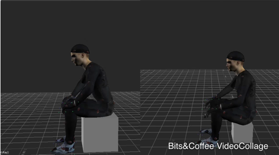
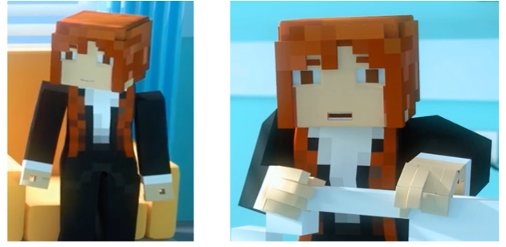
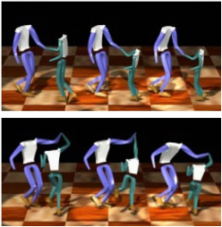
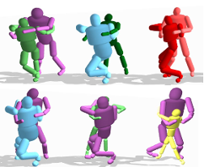
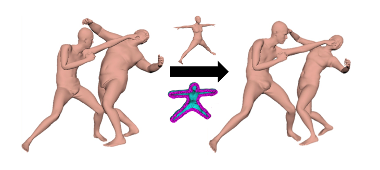
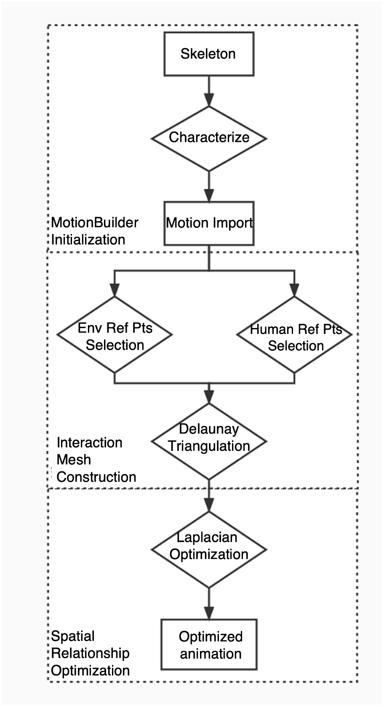
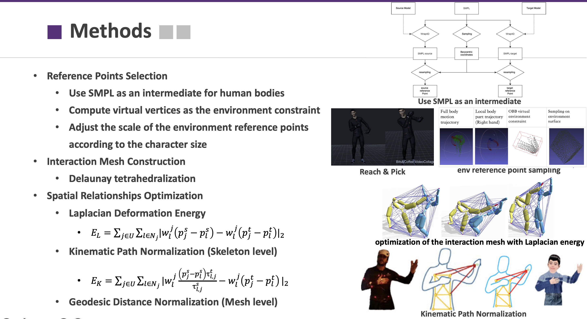

# Human-Scene-Interaction

## Introduction

This study is focused on exploring the "semantics" of human motion with the aim of enabling it to generalize to new scenes. In computer graphics, 3D scenes are frequently reconstructed without human presence, making it a challenging task to synthesize realistic people in scenes, as well as recover humans in scenes. Automation of human motion interaction (HSI) can significantly reduce animation costs and create new possibilities in the AR industry.

For instance, in a scenario where a human sits down on a chair, the character must automatically adjust its motion to accommodate the smaller chair. By studying the semantics of human motion, we can synthesize complex motions based on multiple simple motions. For instance, we could synthesize a human holding handrails while shrugging using three simple motions, such as standing, shrugging, and leaning. This is particularly useful because complex motions can be difficult or hazardous to capture, whereas simple motions can be easily obtained online.

Our approach has the potential to enable the spatial composition of high-quality human motion outcomes and significantly reduce the cost of motion capture.

| HSI examples. People Sitting on different sized chairs. | Examples of motion synthesis.(Standing Shrugging->Holding handrails Shrugging) |
| ------------------------------------------------------- | ------------------------------------------------------------ |
|                          |                                   |

## Related Works

| **Category**                                 | Description                                                  | Figure                      | Limitations                                                  |
| -------------------------------------------- | ------------------------------------------------------------ | --------------------------- | ------------------------------------------------------------ |
| Constraint-based motion synthesis            | motion retargeting of dancing interactions based on positional constraint[2], avoid penetrations by using inequality constraints or a combination of collision detections and equality constraints [3, 4] |  | **Constraint** **based** **methods.** Unable to represent implicit spatial relationship. |
| Character animation by spatial relationships | 1. encoding neighborhood formations and individual trajectories as Laplacian coordinates[6]. |  | **Skeleton-based** **methods.** Unsuitable for capturing skin-level spatial relationships. |
|                                              | 2. Optimize the interaction mesh with pruning and normalization [7, 8] |  | Unable to handle motion retargeting between different sized characters. |

## Contributions

- Skin-level motion retargeting, robust to source and target characters from different dimensions
-  New representations of implicit spatial relationship
-  Enable characters to adapt to new scenes without additional training data

## Experiments

#### Same Character, Different Environment

| Examples (Click to view)                                     |
| ------------------------------------------------------------ |
| [**Exiting** **Car.** **Source** **motion** **in** **green** **and** **adapted** **motion** **in** **red.**](https://www.youtube.com/watch?v=ChwtiJH_kxs) |
| [**Typing.** **Source** **motion** **(left)** **and** **adapted** **motion** **(right).**](https://www.youtube.com/watch?v=-h9FlnuqqTI) |

#### Different Character, Same Environment

**V-Tuber** **in** **live** **room.**

| Sample | Input Data                                                  | Naive Results                                                | Optimized Results                                            |
| ------ | ----------------------------------------------------------- | ------------------------------------------------------------ | ------------------------------------------------------------ |
| 1      | [source motion](https://www.youtube.com/shorts/03UXyakbqEs) | [Retargeted(original)](https://www.youtube.com/watch?v=iClpQllxLVs) | [Retargeted(optimized)](https://www.youtube.com/watch?v=mliP0X2mKZA) |
| 2      | [source motion](https://www.youtube.com/shorts/pvPmi9INIlE) | [Retargeted(original)](https://www.youtube.com/watch?v=Bo3yYgoOtD8) | [Retargeted(optimized)](https://www.youtube.com/watch?v=WQ4dLA_UNXw) |
